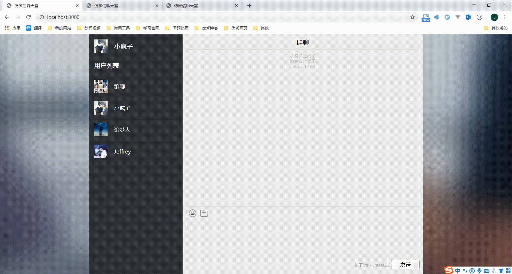

# 仿微信聊天室

在线测试：[仿微信聊天室](http://120.79.198.193:3000/)

项目地址：[仿微信聊天室](https://github.com/Jeffrey-0/ChatRoom)

> 本项目是学习b站的一个教学视频[使用websocket实现一个聊天室](https://www.bilibili.com/video/BV1yi4y1t7yD)，略有改动，添加了私聊功能

## 效果图



## 实现功能

- 在线群聊
- 发送表情
- 上传图片
- 私聊

## 快速开始

1. 安装项目

```shell
git clone git@github.com:Jeffrey-0/ChatRoom.git
```

2. 开启nodejs后台服务

```shell
node app.js
```

3. 浏览器访问

```shell
http://localhost:3000/
```

